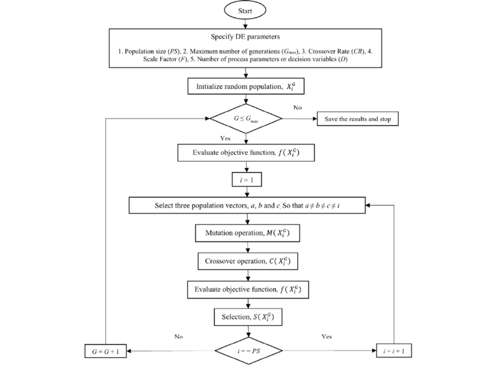

# Case Study

This repository contains a Python implementation of a **Keltner Channel Trading Strategy** for algorithmic cryptocurrency trading. The strategy uses Keltner Channel bands along with additional indicators such as ATR and LWMA to generate buy/sell signals, backtest trades and visualize results, and the Differential Evolution (DE) algorithm, a metaheuristic algorithm for hyperparameter analysis customized to the problem.

## File Structure

- **btc_data.csv**  
  A CSV file containing Bitcoin price data. Used during testing and training processes of the algorithms.

- **Createdata.py**  
  A Python script for generating training or testing data.

- **grph.py**  
  A Python script for plotting and visualizing data. Visualizes trading results and performance.

- **Hiperparameters.csv**  
  A CSV file containing the model's hyperparameters. Used for optimization and model testing.

- **mainalgo.py**  
  The main algorithm file. Executes trading strategies and applies the logic.

- **optialgo.py**  
  A Python script for optimizing trading algorithms. It is focused on improving strategy performance.DE algorithm is used to optimize the following parameters.

    - KCBarOpenserPeriod1(KC_PERIOD)
    - ATRChangesDownPrd1(ATR_PERIOD)
    - MABarClosesPeriod1(LWMA_PERIOD)
    - EnterRvrAtMrkExtAftBrs1(EXIT_AFTER_BARS)
    - EnterRvrAtMrkPrfTrg1(TP_PERCENT)
    - EnterRvrAtMrkStpLss1(SL_PERCENT)

- **trade.csv**  
  A data file that logs executed trades and their outcomes.

- **trading_chart.png**  
  A chart visualizing the performance of the trading algorithms.

## Hyper Parameter Optimization System

This project aims to implement a trading strategy using the Keltner Channel and optimize the parameters used in this strategy. The optimization is performed using the Differential Evolution (DE) algorithm. The strategy generates buy and sell signals based on technical indicators and then simulates trades using these signals.

**DE Algorithm Flow Chart**

**Parameters and Optimization Ranges**

| Parameter         | Description                                      | Range         |
|--------------------|--------------------------------------------------|---------------|
| `KC_PERIOD`        | Period for Keltner Channel calculation.          | 10 - 50       |
| `ATR_PERIOD`       | Period for ATR indicator calculation.            | 20 - 80       |
| `LWMA_PERIOD`      | Period for Linear Weighted Moving Average (LWMA).| 10 - 50       |
| `TP_PERCENT`       | Take-profit level (as a percentage).             | 5 - 20        |
| `SL_PERCENT`       | Stop-loss level (as a percentage).               | 5 - 20        |
| `EXIT_AFTER_BARS`  | Maximum holding time for trades (in bars).       | 50 - 300      |

## Results
When evaluating the results, 3 months were taken as a basis, September 2024, October 2024 and November 2024, each month was run according to the base values and the hyper parameters generated by the optimization algorithm.

| Period        | Base Hyper Parameters                                      | Opt Hyper Parameters     |
|--------------------|-------------------------|---------------|
| `September 2024`        |   6.15%  | 35.56%     |
| `October 2024`       | -2.49%    |  28.64%     |
| `November 2024`      | -16.16%| 28.30%   |

 The results are given in a special table and when the results are analyzed, a minimum profitability increase of 30% was achieved.

